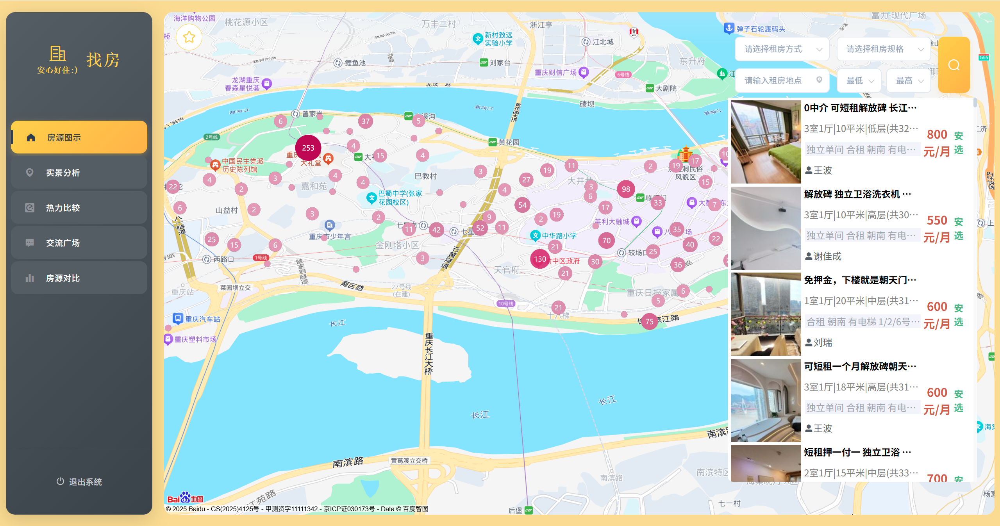
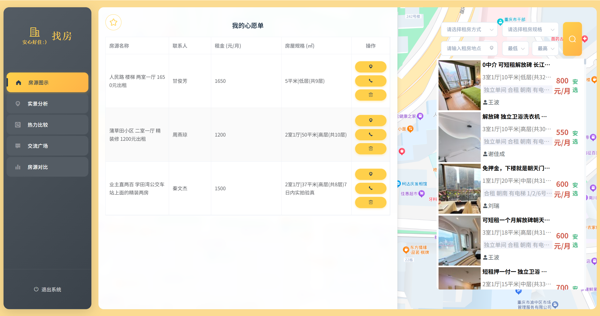
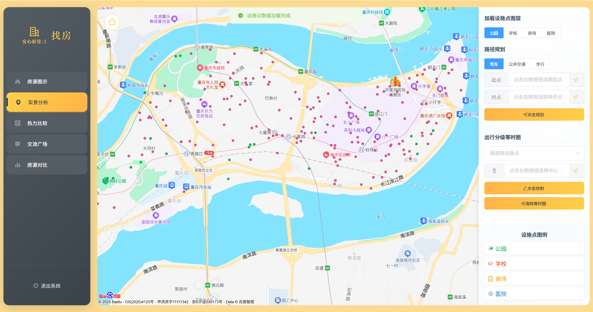
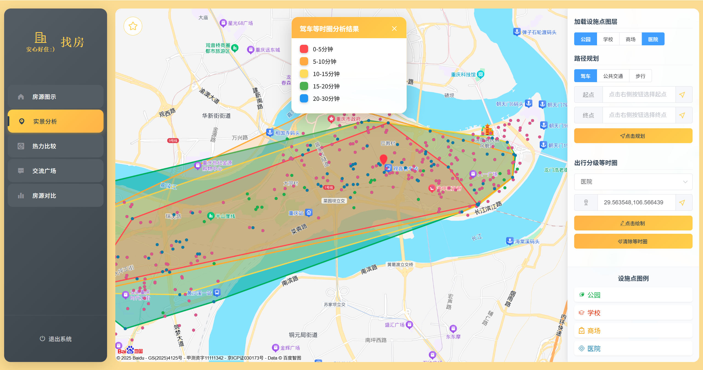
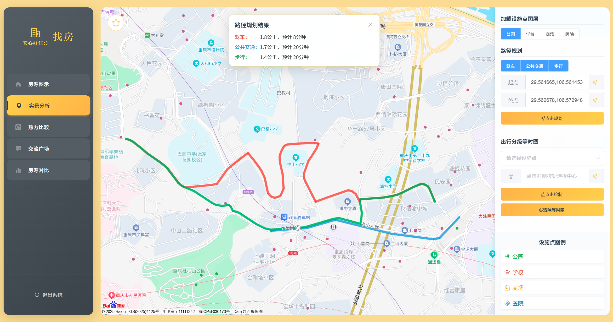
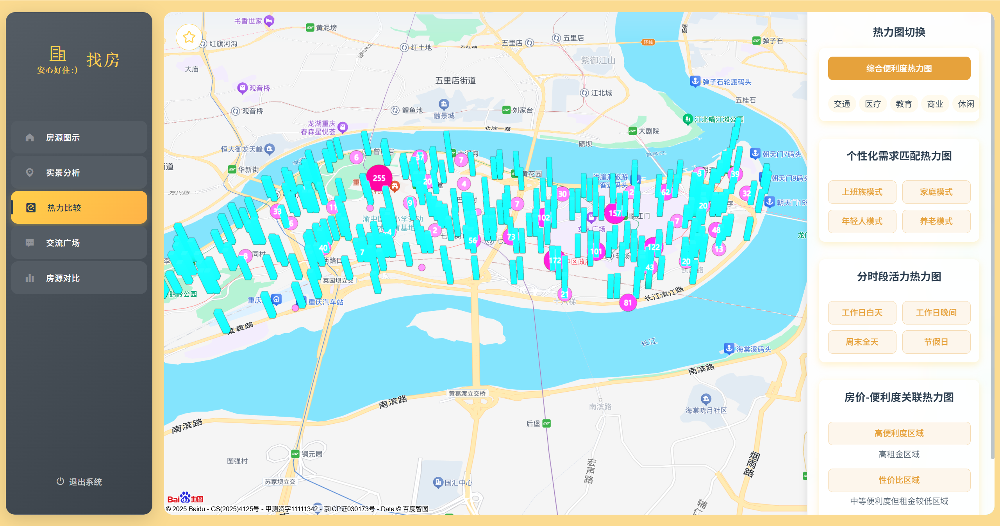
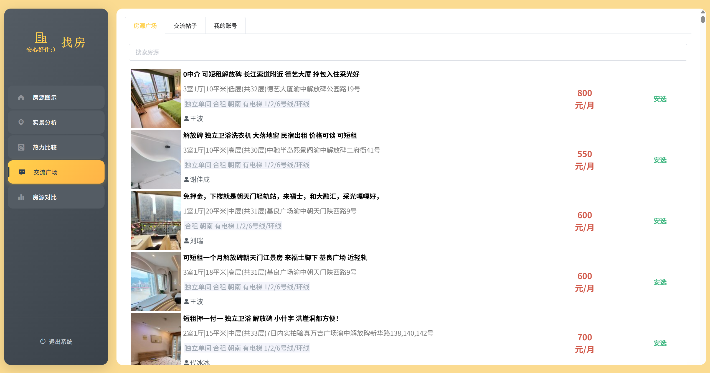
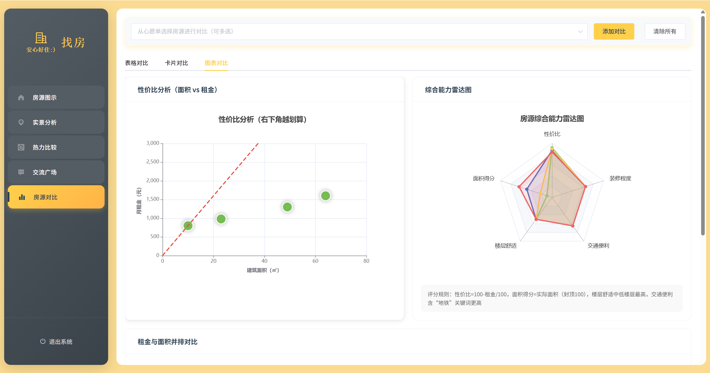

# 重庆渝中区房源可视化展示系统

基于百度地图 WebGL + MapVGL + Vue2 开发的完整房源展示平台

## 功能亮点
- 真实渝中区 2400+ 条安居客房源数据
- 海量点位聚合 + 热力图 + 3D 柱状图
- 心愿单+ 多条件筛选（租金、户型、方式、区域）
- 地图与右侧列表、ECharts 双向联动

## 运行截图

| 房源图示       |  心愿单    | 实景分析 | 等时圈      |
|----------------------|----------------------|-----------------------|----------|
|  |  |  |  |

| 路径规划  | 热力比较           | 交流广场         | 房源对比      |
|-------|----------------------|----------------------|----------------------|
|  |  |  |  |


## 本地运行方式（超简单）
1. 下载本仓库 ZIP 包
2. 解压后在根目录运行
```
# Windows（PowerShell 或 CMD）
python -m http.server 8000

# macOS / Linux
python3 -m http.server 8000

或者
http-server -p 8000
```
3. 推荐使用 Chrome
